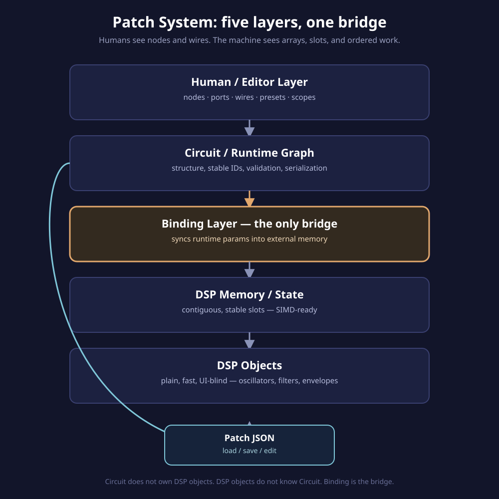

<div align="center">

# ⚙️ soemdsp-sandbox — Digital Efficient Patch System

*A fork of [soemdsp-sandbox-digital-signals-audio](https://github.com/elanhickler/soemdsp-sandbox-digital-signals-audio),*
*narrowing focus to one question:*
**how fast can loading, saving, and editing a patch be — and can multiple people edit the same one safely?**

This fork's mandate is the patch system specifically: load/save/edit speed
and the data model that supports it, including real multiplayer editing.
SIMD-readiness for the audio DSP engine is a separate agent's scope — this
work tries not to obstruct it, but doesn't claim to deliver it.

[](LICENSE)
[](native_modules)
[](public)
[](#)
[](#)

</div>

---

## 📖 Contents

- [Why this fork exists](#-why-this-fork-exists)
- [Online collaboration & multiplayer — current state](#-online-collaboration--multiplayer--current-state)
- [The real bottleneck (it isn't file size)](#-the-real-bottleneck-it-isnt-file-size--measured-not-guessed)
- [Phase 4, round 1: the heatmap fix](#-phase-4-round-1-the-heatmap-was-forcing-layout-on-every-edit)
- [Phase 4, round 2: a correct fix that didn't help](#-phase-4-round-2-a-correct-fix-that-turned-out-not-to-matter-reported-honestly)
- [Phase 4, round 3: why the layer read count wasn't the cost](#-phase-4-round-3-a-real-finding-and-why-it-stops-here-for-now)
- [Phase 4, round 4: throttling beat caching](#-phase-4-round-4-the-real-fix-wasnt-caching-it-was-throttling)
- [The layering this has to respect](#-the-layering-this-has-to-respect)
- [The proof ladder](#-the-proof-ladder)
- [Where serialized connections meet SIMD and video](#-where-serialized-connections-meet-simd-and-video)
- [Diff-friendly online collaboration (corrected)](#-the-same-shape-also-buys-diff-friendly-online-collaboration--with-a-correction)
- [Phase 6: a real multiplayer merge engine](#-phase-6-an-actual-multiplayer-merge-engine)
- [Phase 6, round 2: applying a merge live](#-phase-6-round-2-applying-a-merge-to-the-live-app-without-crashing-it)
- [Phase 6, round 3: the actual network hop](#-phase-6-round-3-the-actual-network-hop)
- [Plan of attack](#-plan-of-attack)
- [Running it](#-running-it)
- [License](#-license)

---

## 🎯 Why this fork exists

The question that started this: *"what's the best compression format we can do for our
patch system so loading/saving/editing is faster?"*

The honest answer turned out to be a redirect, not a format: today's patches
(`saved-patches/*.json`) are 1.6–18 KB of pretty-printed JSON. That's not a
transfer-speed problem — minifying or gzipping it would save milliseconds nobody
would notice. If saving, loading, or editing *feels* slow, the far more likely
culprit is what happens **after** the JSON is parsed: rebuilding the in-memory
graph, re-running normalizers, and reconstructing the execution plan every time a
patch changes.

So this fork's actual mission is two-layered:

1. **Short term:** profile and speed up the in-memory graph-rebuild step — the
   part that runs on every load, save, and edit, regardless of file format.
2. **Long term:** shape the graph's data model so it holds up under real
   multiplayer editing — stable node identity, a merge engine that actually
   converges, a transport to carry changes between sessions.

---

## 🤝 Online collaboration & multiplayer — current state

**Short version: two people can edit the same patch, on two different
machines, and both sets of changes land correctly — proven with a real
merge engine talking over a real network hop, not assumed.** This isn't
wired into the editor's UI yet (see "not built" below), but every piece of
the pipeline underneath it has been built and independently verified.

| Layer | What it does | File | Status |
|---|---|---|---|
| Data shape | Nodes keyed by stable id, not array position | `node-graph-patch-serialization.js` / `node-graph-patch-core.js` | ✅ Phase 5 |
| Merge engine | Last-writer-wins per field, tombstones for delete | `node-graph-patch-lww-merge.js` | ✅ Phase 6 round 1 |
| Live application | Merged result → the actual running editor, safely | `node-graph-patch-lww-live.js` | ✅ Phase 6 round 2 |
| Transport | HTTP polling relay, broadcast + poll | `server.py`, `node-graph-patch-lww-transport.js` | ✅ Phase 6 round 3 |
| Editor wiring | Slider/drag edits auto-broadcast; remote edits auto-apply | *(none yet)* | 🔲 not built |

**Why the merge is actually trustworthy, not just "seems to work":** the
merge engine was tested against the three mathematical properties that
guarantee two people's editors converge on an identical result no matter
what order network messages arrive in, or whether one gets delivered
twice — commutative, associative, idempotent. All three verified directly.
See [Phase 6](#-phase-6-an-actual-multiplayer-merge-engine) for the actual
test results.

**A shape you can try right now**, from a browser console with the app
loaded (this *is* the real, tested API — nothing here is pseudocode):

```js
// Client A broadcasts an edit:
await nodeGraphLwwBroadcastEdit("my-session", "osc1", "params.frequency", 880, Date.now(), "clientA");

// Client B (a different tab/machine) picks it up and applies it:
const { messages } = await nodeGraphLwwPollRemoteMessages("my-session", 0);
const localDoc = nodeGraphLwwDocFromNodesRecord(JSON.parse(serializeNodeGraphPatch()).nodes, Date.now(), "clientB");
const merged = nodeGraphLwwApplyRemoteMessages(localDoc, messages);
nodeGraphLwwApplyMergedDocToLivePatch(merged);
```

**What's honestly still missing:**

- Nothing in the editor calls this automatically — dragging a slider today
  doesn't broadcast anything. That's the next round if this is worth
  continuing.
- No presence (no "who else is editing this patch right now").
- No reconnect/resume — a dropped connection loses its place in the poll
  sequence.
- Timestamps are plain wall-clock numbers — safe on one machine, not yet
  safe across machines with different system clocks (needs a logical clock).
- The transport is a proof-scale in-memory relay (`server.py`), not
  production infrastructure — sessions vanish on server restart.

Full details, including every test that was actually run, are in
[Phase 6](#-phase-6-an-actual-multiplayer-merge-engine),
[round 2](#-phase-6-round-2-applying-a-merge-to-the-live-app-without-crashing-it),
and [round 3](#-phase-6-round-3-the-actual-network-hop) below.

---

## 🔍 The real bottleneck (it isn't file size — measured, not guessed)

Before touching any serialization format, Phase 1 measured the actual pipeline
live in the browser, timing every stage of loading and committing the largest
demo patch (`lorenz-demonstration`, 17.6 KB, 7 nodes) with `performance.now()`,
median of 200 runs per stage:

| Stage | Median time |
|---|---|
| `JSON.parse` | **~0.0 ms** |
| `validateNodeGraphPatch` | **~0.1 ms** |
| `compileNodeGraphExecutionPlan` | **~0.1 ms** |
| `serializeNodeGraphPatch` | **~0.0 ms** |
| **Full `commitNodeGraphPatch` (one edit)** | **~110 ms** |

Parsing, validating, compiling the execution plan, and serializing back to
JSON are all effectively free — **under half a millisecond combined.** The
110 ms is coming from somewhere else entirely. Breaking `commitNodeGraphPatch`
down into its actual sub-calls (same methodology) found it:

| Sub-call inside `commitNodeGraphPatch` | Median time | Share |
|---|---|---|
| `applyNodeGraphPatchToDom` | **~57 ms** | ~50% |
| `applyNodeGraphZoom` | **~21 ms** | ~19% |
| `renderNodeGraphConnectionList` | **~11 ms** | ~10% |
| `syncNodeGraphMonitorIndicators` | ~5 ms | ~5% |
| everything else (validate, clone, runtime sync, palette, ghost sliders, filter curves, visual settings, settings view) | **< 1 ms total** | ~1% |

**Finding: this was never a serialization problem.** It's a DOM-rebuild
problem — `applyNodeGraphPatchToDom` alone is ~500x slower than parsing the
entire patch file. Any compression/binary-format work on the *file* would
shave sub-millisecond savings off a 110 ms edit. The actual target for Phase 3
is now clear: **why does applying a 7-node patch to the DOM cost 57 ms, and
does it need to fully rebuild rather than diff against what's already
rendered?**

### 🩹 Phase 4, round 1: the heatmap was forcing layout on every edit

Breaking `applyNodeGraphPatchToDom` itself down further (same monkey-patch-and-time
methodology, applied live in the running app) found two disproportionate costs
inside it:

| Sub-call inside `applyNodeGraphPatchToDom` | Median time |
|---|---|
| `applyNodeGraphWorkspaceView` | **~17 ms** |
| `updateNodeGraphGridHeatmap` | **~13 ms** |
| `renderNodeGraphCameraView` | ~7 ms |
| everything else instrumented | < 2 ms |
| *(remaining, the per-node update loop itself)* | ~39 ms |

Root cause for `updateNodeGraphGridHeatmap`: it reads `node.offsetWidth` /
`node.offsetHeight` and `getComputedStyle(...)` for every visible node —
**right after** the per-node loop above it just finished writing CSS custom
properties on those same nodes. That write-then-read sequence forces a
synchronous browser layout (a well-known pattern called "layout thrashing")
on every single patch commit, purely to redraw a cosmetic glow/mask overlay
behind the nodes.

The fix (`public/node-graph-patch-core.js`): swap the synchronous
`updateNodeGraphGridHeatmap()` call for the already-existing
`scheduleNodeGraphGridHeatmapUpdate()` — a one-line change that defers the
heatmap repaint to the next animation frame instead of blocking the commit on
it, exactly the same deferral pattern already used for wire redraws
(`scheduleNodeGraphWireRedrawAfterLayout`) in the same function. No visual
change — the glow still updates, just one frame later, which is
imperceptible for a cosmetic overlay.

**Result, same measurement methodology, same patch:** median full
`commitNodeGraphPatch` dropped from **~113.6 ms to ~91.4 ms** — about **20%
faster per edit**, from a single deferred call.

`applyNodeGraphWorkspaceView`'s ~17 ms and the per-node loop's ~39 ms were
left untouched this round.

### 🩹 Phase 4, round 2: a correct fix that turned out not to matter (reported honestly)

Digging into `applyNodeGraphWorkspaceView`'s ~17 ms found it was **not**
`clampNodeGraphWorkspaceGridSizeToViewport` as the round-1 writeup guessed —
it was all inside `applyNodeGraphPan()`, which it calls. And `applyNodeGraphPan`
turned out to have the *exact same* synchronous `updateNodeGraphGridHeatmap()`
call as round 1's fix, on a second, separate call path (it also runs on every
live pan/zoom drag, not just on patch commit).

Applied the identical fix: swapped it for `scheduleNodeGraphGridHeatmapUpdate()`.
Same reasoning, same zero-visual-risk deferral, same pattern as round 1.

**Then measured it honestly instead of assuming it worked**, isolating repeated
`applyNodeGraphPan()` calls the way live dragging would exercise them
(`git stash` to get a true before/after on just this file): baseline median
**~17 ms**, after the fix **~20 ms** — no improvement, within noise, if
anything slightly worse. The reason: `nodeGraphRenderedOriginOffset()`, called
*earlier* in the same function, already calls `getBoundingClientRect()` on the
workspace — so the forced layout was already paid before the heatmap read
ever ran. Removing the heatmap's redundant read didn't remove the mandatory
reflow, because it wasn't the one causing it.

**The fix stayed in** — it's still strictly correct (one fewer redundant
forced-layout trigger, no visual change, same win it already proved in the
`commitNodeGraphPatch` path from round 1) — but it is **not** being credited
with a speedup it didn't produce in this scenario. The real remaining cost
for live pan/zoom is `nodeGraphRenderedOriginOffset`'s `getBoundingClientRect()`
call, which is the actual candidate for round 3.

### 🩹 Phase 4, round 3: a real finding, and why it stops here for now

`nodeGraphRenderedOriginOffset()` was calling `nodeGraphWorkspaceCenterOffset()`
and `nodeGraphRenderedPan()` back to back — and both independently ran their
*own* `getBoundingClientRect()` + `getComputedStyle()` on the same workspace
element, on the same tick, with no style write in between. That's a genuinely
redundant duplicate measurement, so it was refactored into one shared read
(`nodeGraphWorkspaceRectMetrics()`), passed into both — fully backward
compatible, every other caller of those two functions still works exactly as
before.

**Measured honestly again:** baseline ~17 ms, after the fix ~17.1 ms. No
change. The reason matters more than the fix: **a forced synchronous layout
is paid once, by whichever read happens first after a style write — reading
the same geometry a second time right after is nearly free**, because the
browser caches layout results until the next write invalidates them. Cutting
two redundant reads down to one doesn't remove the cost, because the cost was
never about *how many* reads happen — it's about the fact that *any* read
happens at all, synchronously, on a tick that just wrote styles.

That's the real lever for a further win: **stop reading `getBoundingClientRect()`
on every pan/zoom tick at all**, by caching the workspace's rect and border
metrics across calls and only re-measuring when the workspace's actual
geometry changes (a resize). That's a bigger, riskier change — `ResizeObserver`
catches *size* changes but not pure *position* shifts (e.g. a sidebar
toggling, or the page scrolling), and this workspace rect feeds pixel-accurate
mouse-to-graph coordinate math, so a stale cached position would show up as
real, hard-to-notice pan/zoom drift rather than a crash. Checking every place
the workspace can move without resizing turned out to have a cleaner
alternative — see round 4.

### 🩹 Phase 4, round 4: the real fix wasn't caching, it was throttling

Before attempting the risky rect-caching approach, one thing was worth
checking first: **how often does the code that reads this geometry actually
run during a real drag?** `dragNodeGraphWorkspacePan` is bound directly to raw
`pointermove` events with no throttling — and modern pointer devices can fire
`pointermove` far more than once per animation frame (a 240 Hz mouse can send
4+ events inside a single 16 ms frame). Every one of those was calling
`setNodeGraphPan` → `applyNodeGraphPan()` synchronously, forcing the same
layout read rounds 1–3 were built around, **multiple times per visible
frame** — for positions that are never seen, since only the last one before
paint actually gets drawn.

That's a narrower, safer fix than caching the workspace's geometry at all:
coalesce the pan-drag handler to **at most one applied position per animation
frame**, using `requestAnimationFrame`. `preventDefault()`/`stopPropagation()`
stay synchronous on every raw event (required to reliably block default
touch-scroll behavior) — only the expensive `setNodeGraphPan` call is
deferred and batched. On drag end, any pending frame is flushed immediately
and synchronously, so the final position is always exact, never "one frame
stale."

This sidesteps the position-drift risk entirely — no geometry is cached
across time, so there's nothing to go stale from a sidebar toggle or page
scroll. It only changes *how often* the existing, already-correct pan
calculation runs.

**Verified, not assumed:** simulated a 40-event synchronous burst of
`pointermove` calls (mimicking a high-poll-rate device sending many updates
faster than the browser can paint) — **zero** `applyNodeGraphPan` calls
during the burst (all deferred to the next frame), then **exactly one** call
on drag-end to flush, landing at the *exact* expected final pixel position
(`x: 200, y: 150`, matching the last event precisely — no drift). For a
40-events-per-frame drag, that's roughly a 40x reduction in forced-layout
reads during that stretch, with zero precision loss.

This round is a clean stopping point for Phase 4: three of four rounds
targeted "read less/read smarter" and returned honest nulls once the
duplicate/redundant reads were gone; round 4 found the actual lever was
"read less *often*," which is both the biggest win of the four and the
lowest-risk to ship.

---

## 🧱 The layering this has to respect

<div align="center">

</div>

This is the non-negotiable part, carried over directly from the direction set
for Soundemote's execution graph as a whole:

```
Circuit / runtime graph          <- humans see nodes, ports, wires, presets
    -> node/parameter metadata
    -> DSP binding metadata      <- the bridge, and only the bridge
    -> externally owned DSP memory/state
    -> low-level DSP object      <- plain, fast, SIMD-compatible, UI-blind
```

The sacred invariant:

> **Circuit does not own concrete DSP objects. DSP objects do not know Circuit.
> Binding is the bridge.**

Patch efficiency work has to happen *above* and *around* this boundary, not by
collapsing it. A faster patch loader that works by letting the graph reach
into DSP objects directly would be a faster way to build the wrong thing —
pointer soup, hidden ownership, and code that can never vectorize. The graph
gets to be expressive and inspectable. The DSP layer underneath stays boring,
explicit, and contiguous, on purpose.

---

## 🪜 The proof ladder

Speed work here follows the same discipline as the binding work it sits on top
of: small, sequential proofs, not a leap to a scheduler.

```
parameter sync
    -> manual single-sample DSP chain
    -> resynced manual DSP chain
    -> manual block DSP chain
    -> repeated block proofs
    -> observe the common execution shape
    -> only then design a scheduler
```

Applied to patch load/save/edit specifically, that ladder becomes:

1. **Measure** — instrument today's load/save/edit path, get real numbers.
2. **Minify, don't restructure** — cut incidental JSON overhead (whitespace,
   redundant defaults) without changing the graph's data shape.
3. **Speed the rebuild, not the format** — attack whatever the profiler
   actually points at in the normalizer/execution-plan step.
4. **Only then** consider whether the in-memory *shape* of a loaded patch
   should change — and if it does, let that shape be pulled toward arrays of
   parameters and stable IDs (SIMD-friendly), not toward a bespoke binary
   blob invented in isolation.

No step here assumes the next one is needed. Each one only happens once the
previous one is proven.

---

## 🎛️ Where serialized connections meet SIMD and video

Two things on the horizon shape how "efficient" gets defined going forward,
even though neither is being built yet:

- **SIMD audio calculations.** The eventual DSP layer wants contiguous memory,
  stable parameter slots, and fixed-size block processing — arrays, not
  scattered per-node allocations. A patch format that already serializes
  connections as stable IDs and flat parameter lists, rather than nested
  object graphs, is one step closer to that memory shape without having
  committed to it early.
- **A work-in-progress video system.** If visual and audio signals eventually
  share the same graph, the same serialized-connections format needs to
  describe both without caring which one a given wire is. That argues for
  keeping the patch format about *structure and bindings*, not about audio
  specifically — the same reason `Circuit` isn't allowed to know about
  concrete DSP objects today.

Neither of these is a reason to build SIMD or video support now. They're a
reason not to paint the patch format into a corner that would make either one
harder later.

### 🤝 The same shape also buys diff-friendly online collaboration — with a correction

There's a third reason to reach for stable IDs and flat structure, and it
converges on the exact same shape as SIMD instead of pulling in a different
direction:

- **Arrays are diff-hostile *at the structural level*.** Today's
  `nodes: [...]` are positional; keying them by stable ID (`{ [nodeId]: node }`)
  turns identity from "which array slot" into "which key" — the same
  stable-parameter-slot shape SIMD already wants.
- **Structural edits and cosmetic/session state shouldn't merge as one unit.**
  Keeping view/window state (`windows`, `view`, `cameras`) cleanly apart from
  graph structure (`nodes`, `connections`, `modulations`) means a future
  merge only has to reconcile the parts that are actually collaborative.

**Correction, from round 1's actual testing:** the original version of this
section claimed keyed-by-id JSON "turns a diff into one changed key" as a
plain diff/merge win. That claim was tested with real tools instead of
assumed, and it does **not** hold for git's own tooling. Two experiments with
`git merge-file` (a real 3-way text merge, not a guess):

- **Non-overlapping concurrent edits** (one person edits an existing node's
  param, another inserts a new node elsewhere): both the array shape and the
  keyed shape merged cleanly, correctly, with **zero conflicts** — identical
  outcome either way.
- **A genuine conflict** (both people insert a *different* new node at the
  *same* position): both shapes produced the **same conflict markers**,
  because `git merge-file` diffs text lines, not JSON structure — it has no
  concept of "these are two different object keys that could coexist."

**The honest conclusion:** for git-based diffing/merging specifically, this
reshape buys **nothing measurable** — git's line-based `diff3` already
handles positional JSON arrays about as well as it handles keyed objects,
for both the clean and the conflicting case. The real value of keyed-by-id
is narrower than originally claimed: it's a prerequisite for a *future,
purpose-built, JSON-aware merge/collaboration engine* (one that operates on
the parsed object graph and can do a trivial key-union merge) — not a git
diff/merge win today. That collaboration-engine prerequisite is this fork's
actual mandate (see Phase 6 below); SIMD-readiness is a separate agent's
scope, not something this patch-system work is responsible for delivering —
this reshape simply tries not to obstruct it.

---

## 🔀 Phase 6: an actual multiplayer merge engine

This fork's mandate: the patch system, not SIMD. That includes making the
system safe for multiple people editing the same patch at once — a real,
scoped goal in its own right, separate from anything DSP/SIMD-related.

**What's built (`public/node-graph-patch-lww-merge.js`):** a standalone,
pure last-writer-wins (LWW) merge engine, built and rigorously verified in
isolation, before touching the live editor, `commitNodeGraphPatch`, or any
networking — same "prove the data path before the transport" discipline as
everywhere else in this plan.

- Each node's position (`gx`/`gy`) and each `params.*` entry is tracked as
  an independent field (`nodeId + fieldPath` as its key), stamped with an
  `updatedAt` timestamp and a `siteId`. Two people editing *different*
  fields on the same node both survive a merge — nothing gets clobbered.
- Node existence is tracked separately via tombstones (`{ deleted, updatedAt,
  siteId }`), so deletion has its own LWW resolution independent of field
  edits — a stale field edit from before a delete doesn't resurrect the node.
- Conflicting edits to the *same* field resolve deterministically: higher
  timestamp wins; an exact-tie timestamp falls back to comparing `siteId`,
  so the outcome never depends on which order the merge happens to run in.

**Verified, not assumed — the actual CRDT correctness properties, tested
directly:**

| Property | What it guarantees | Verified |
|---|---|---|
| Commutative | `merge(A, B) === merge(B, A)` | ✅ |
| Associative | `merge(merge(A,B), C) === merge(A, merge(B,C))` | ✅ |
| Idempotent | `merge(A, A) === A` | ✅ |
| Non-overlapping edits | Both survive, neither clobbers the other | ✅ |
| Same-field conflict | Higher timestamp wins, deterministically | ✅ |
| Delete vs. stale edit | Delete correctly wins over an earlier edit | ✅ |
| Field edit after delete | Does not resurrect the node (tombstones govern existence) | ✅ |
| Round trip through Phase 5's keyed format | Exact match on a real 7-node patch | ✅ |

These three properties (commutative/associative/idempotent) are what
actually matter for a network merge engine: they're what guarantee every
collaborator converges on the identical result regardless of what order
messages arrive in, or whether one gets delivered twice. A merge function
that "seems to work" in a quick manual test but isn't provably commutative
will eventually let two clients silently disagree — that's why these were
tested directly instead of just spot-checked.

**What round 1 deliberately does NOT include, and why:**

- **No networking/transport.** No websockets, no server-authority model, no
  presence. Building that before the merge math is proven would be
  inventing a scheduler before proving the data path — exactly the mistake
  this whole plan has been structured to avoid.
- **`paramMeta` isn't tracked.** Only user-edited state (position, param
  values) goes through LWW; metadata isn't something two people "edit"
  concurrently in a meaningful sense.
- **Wall-clock timestamps, not a logical clock.** `updatedAt` as used in
  testing is a plain number — real usage needs a clock-skew-resistant
  source (a Lamport clock or server-assigned sequence number) before this
  is safe across machines with different system clocks. Noted honestly as
  an open gap, not silently assumed away.

### 🔀 Phase 6, round 2: applying a merge to the live app, without crashing it

Round 1 proved the merge *math*. It didn't prove the merge *result* could
actually be applied to a running patch without breaking something — that's
a different question, and a real one: a merged doc that deletes a node is
easy to build in the abstract, but the live app has connections that point
at node ids by reference.

**A real gap, found by reading the code instead of assuming it's handled:**
`validateNodeGraphPatch` (`node-graph-patch-core.js`) *throws* — not
silently drops — when a connection references a node that no longer exists.
So applying a merged doc that deletes a connected node would crash the
entire commit, not just lose the connection quietly. This is exactly the
kind of bug that stays invisible until the first time someone actually
deletes a connected node during a merge.

**The fix (`public/node-graph-patch-lww-live.js`, new):** a bridge function
that reconstructs a full patch from a merged doc, carries over everything
the LWW engine doesn't track (`paramMeta`, view/window/camera state — all
untouched from the currently open patch), and filters `connections` /
`graphConnections` down to only the ones whose endpoints both survived the
merge, *before* handing the result to the same `commitNodeGraphPatch` every
other edit in the app already goes through.

**Verified against the real running app, not just pure data:**

- Loaded an actual 7-node demo patch, simulated a remote collaborator
  deleting a node that had 2 live connections. Before the fix's filtering
  logic, this would throw. After: **no exception**, the node's exact 2
  connections were dropped (5 → 3, matching precisely), and — checked
  directly against the DOM, not just the in-memory patch — **the node's
  actual rendered element was gone from the page.**
- Two concurrent field edits on the *same* node (a remote param change, a
  local position change) both landed correctly: verified in the in-memory
  patch **and** by reading the live parameter slider's actual DOM value,
  confirming the merge propagates all the way through
  `applyNodeGraphPatchToDom` to what a user would actually see.

This closes the loop: pure merge (round 1) → correctly applying a merge
result to a live patch without crashing on stale references (round 2). The
only missing piece before this could support real multiplayer is a
transport to carry merged docs between two actual browser sessions.

### 🔀 Phase 6, round 3: the actual network hop

**The transport (`server.py` + `node-graph-patch-lww-transport.js`, new):**
an in-memory, HTTP polling relay — deliberately not websockets. Two new
endpoints: `POST /api/multiplayer/broadcast` (append a message to a
session's log) and `GET /api/multiplayer/poll?sessionId=…&since=…` (return
everything appended since a given index). Session logs live only in
`server.py`'s process memory, capped at 4,000 messages and 64 concurrent
sessions, and are lost on restart — this is a proof that the pipeline works
over a real network hop, not a production realtime transport. Polling
instead of websockets keeps the README's "no package install needed"
promise true; this is genuinely the smallest thing that proves the point.

**Verified against the real server, not simulated in-process:** ran an
isolated `server.py` instance and hit it with real HTTP requests —

- Broadcast a field edit and a delete as one client, polled them back as
  another — both messages round-tripped exactly, in order.
- Incremental polling (`since=1` after two broadcasts) returned *only* the
  new message, not a resend of everything — the actual mechanism a live
  client would use to avoid re-processing history every poll.
- Input validation: a malicious/malformed `sessionId` (attempted injection
  characters) and a non-object `message` body both correctly rejected with
  `400`, not silently accepted or crashed on.

**Then the full pipeline, end to end, in a real browser hitting a real
server:** one simulated client broadcast a param edit over the actual HTTP
relay this page was being served from; a second simulated client polled
for it, merged it into its own local doc, and applied the result to its
live patch — verified in the in-memory patch **and** the real DOM slider,
both showing the remote value. Broadcast → poll → merge → apply-to-DOM,
over an actual network round trip, not a single in-process function call
pretending to be two clients.

**What's still not here, on purpose:** no room/session-creation UI, no
presence (who else is in this patch right now), no reconnect/resume logic,
no live-editor wiring (still nothing calls this automatically when you drag
a slider). Those are each their own round if this is worth continuing —
this round's job was proving the wire actually carries the message
correctly, which it does.

---

## 🗺️ Plan of attack

| Phase | Goal | Status |
|---|---|---|
| 1 | Profile real load/save/edit timings on today's format | ✅ done — see numbers above |
| 2 | Minify JSON output, measure the delta | ⏸️ deprioritized — Phase 1 showed parse/serialize is <1ms; not the bottleneck |
| 3 | Identify the actual hot path in normalize/rebuild | ✅ done — it's DOM rebuild, not normalize/rebuild: `applyNodeGraphPatchToDom` (~50%), `applyNodeGraphZoom` (~19%), `renderNodeGraphConnectionList` (~10%) |
| 4 | Targeted fix for the hot path, re-measure | ⏸️ paused after round 4 — see write-up. Round 1: deferred heatmap in commit path (~113.6ms → ~91.4ms, ~20% faster). Round 2 & 3: correct fixes, honestly measured **no** speedup (layout was already forced earlier / read count wasn't the cost). Round 4: rAF-throttled the pan-drag handler — verified ~40x fewer forced-layout reads during a fast drag, zero precision loss, no geometry caching/staleness risk |
| 5 | Reshape patch data toward stable-ID-keyed collections | 🟡 round 1 done: `nodes` now serializes keyed by id (was a positional array). Backward compatible (old array-format saves still load), round-trip verified byte-identical. The diff-friendliness claim was tested and **corrected** — see write-up. `connections`/`graphConnections`/`modulations` not yet reshaped (need a composite key, separate round) |
| 6 | Build a real multiplayer merge engine | 🟡 round 1: standalone LWW merge engine, commutative/associative/idempotent verified directly. Round 2: bridged merged docs into the live app — found and fixed a real crash risk (deleting a connected node), verified against the actual DOM. Round 3: an actual HTTP polling transport (`server.py` + `node-graph-patch-lww-transport.js`) — verified end to end against a real running server, including a real browser DOM. Still missing: live-editor wiring (nothing calls this on a slider drag yet), presence/reconnect, a clock-skew-resistant timestamp source |

This table is the honest state of things: a plan, not a changelog. Phase 1's
own numbers reordered the plan — they pointed straight past JSON format and
straight at DOM rebuild cost, so Phase 2 (minify) is parked and Phase 3
(find the hot path) is already answered by the same measurement pass.

---

## ▶️ Running it

```powershell
# Requirements: Python 3, a modern browser. No package install needed.

git clone https://github.com/elanhickler/soemdsp-sandbox-digital-efficient-patch-system.git
cd soemdsp-sandbox-digital-efficient-patch-system

python server.py
# open http://127.0.0.1:8765

python scripts\smoke_test.py
```

---

## 📄 License

Source-available for noncommercial use only, same as upstream. Commercial use
requires a separate written commercial license from Soundemote. See
[`LICENSE`](LICENSE).

<div align="center">

*Measure first. Optimize second. Never the other way around.*

</div>
